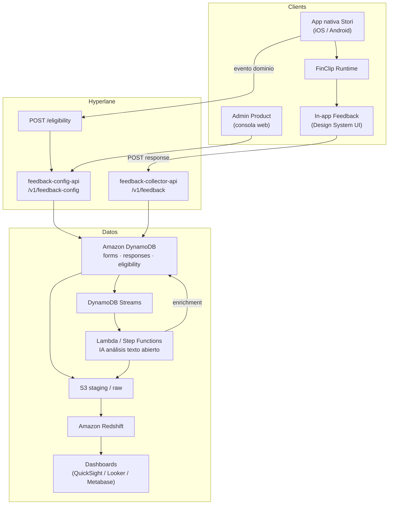
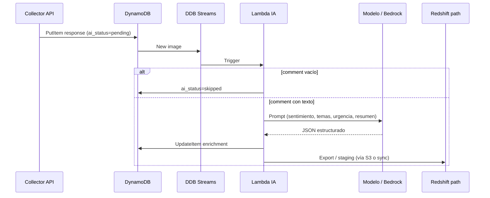
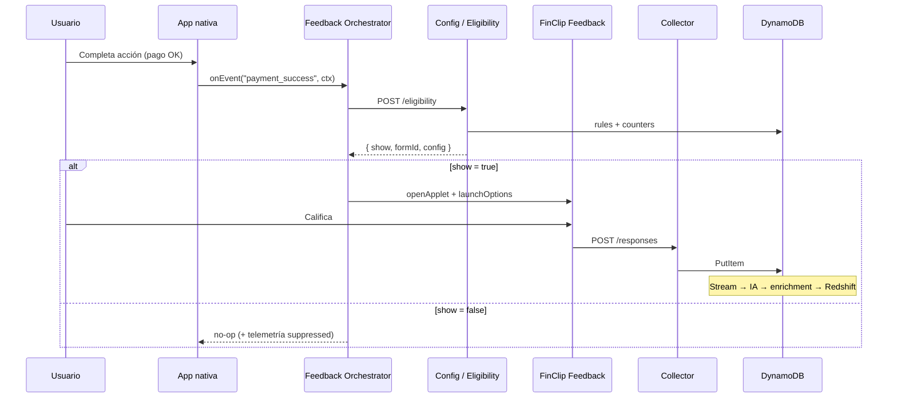

# CSAT Bendita entre los hombres — Arquitectura de producción

Documento compartible para el pitch y alineación de equipos (Product, App, Backend, Data, AI).

**Producto:** sistema parametrizable de calificación de servicio (bottomsheet)  
**MVP:** Vue 3 + Design System (repo `col-hackathon`)  
**Runtime objetivo:** in-app **FinClip** dentro de la app nativa Stori  
**Almacenamiento:** **DynamoDB**  
**Análisis cualitativo:** **IA** sobre respuestas abiertas  
**Analítica / visualización:** **Amazon Redshift** (+ dashboard de producto)

---

## 1. Resumen ejecutivo

Hoy el MVP demuestra el ciclo completo en el browser: crear formulario → disparar evento → capturar feedback → ver métricas.

En producción:

1. La **app nativa** emite un evento de dominio (ej. `payment_success`).
2. Un **orchestrator** decide si mostrar la encuesta (frecuencia + elegibilidad).
3. Se abre el **in-app FinClip** con la UI del Design System.
4. La respuesta se persiste en **DynamoDB**.
5. Un pipeline de **IA** enriquece comentarios abiertos (sentimiento, temas, urgencia).
6. Los datos fluyen a **Redshift** para visualización y análisis de negocio.

> Product configura formularios sin release de app. Ingeniería solo emite eventos técnicos estables.

---

## 2. Beneficios y ventajas

| Audiencia | Beneficio |
|-----------|-----------|
| Usuario | Feedback corto, contextual, en el momento del journey |
| Product | Parametriza eventos, copy, píldoras y frecuencia sin ticket de eng |
| Negocio | Escucha continua por producto / evento / versión de app |
| Data / AI | Comentarios abiertos estructurados por IA → insights accionables en Redshift |
| Design | Misma experiencia visual (Design System) dentro de FinClip |

**Ventajas clave**

- Ciclo cerrado: Admin → Trigger → Bottomsheet → Persistencia → IA → BI
- Deploy del in-app independiente del store (FinClip)
- DynamoDB para escritura de alta frecuencia y config flexible
- IA que convierte texto libre en señales cuantificables
- Redshift como capa de consulta y dashboards compartidos

---

## 3. Arquitectura de alto nivel



---

## 4. Capas de software

### 4.1 App nativa + FinClip

| Pieza | Responsabilidad |
|-------|-----------------|
| Host nativo | Emite eventos de dominio, consulta elegibilidad, abre el mini-program |
| FinClip SDK | Runtime del in-app |
| Mini-program Feedback | UI: estrellas → píldoras → texto libre → gracias |
| Bridge | `launchOptions` / `sendCustomEvent` (host → in-app); auth / close (in-app → host) |

El in-app **no decide cuándo mostrarse**; solo renderiza y envía la respuesta.

### 4.2 APIs Hyperlane

Paths bajo convención `/{api_version}/{service-name}`:

| Servicio | Path base | Rol |
|----------|-----------|-----|
| Config | `/v1/feedback-config` | CRUD de formularios, versiones, reglas de frecuencia |
| Collector | `/v1/feedback` | Ingesta de respuestas + lectura operacional |
| Eligibility | `POST /eligibility` (mismo servicio config o collector) | ¿Mostrar sheet? + snapshot de form |

Headers internos S2S: `x-request-id`, `x-stori-authorization` (`lane#team`). Cliente: **restclient/v2**.

Registro de operaciones en **hyperlane-registry** al exponer endpoints.

### 4.3 Admin / Product Console

Evolución del “Admin / Creador” del MVP:

- Catálogo de formularios (nombre, descripción, `eventName` técnico, producto, frecuencia, preguntas, píldoras)
- Preview del bottomsheet
- Versionado de formularios (`form_version`) para no romper histórico

---

## 5. DynamoDB — modelo de datos

DynamoDB es el store operacional (baja latencia, writes frecuentes desde app).

### Tablas propuestas

#### `feedback_forms`

| PK / SK | Atributos principales |
|---------|------------------------|
| `PK = PRODUCT#Credit` | `formId`, `ratingName`, `description` |
| `SK = FORM#form-payment-success` | `eventName`, `frequency`, `welcomeTitle`, `q1Label`, `q2Label`, `q3Label`, `pills[]`, `enabled`, `formVersion`, `updatedAt` |

GSI opcional: `GSI1PK = EVENT#payment_success` → lookup por evento técnico.

#### `feedback_responses`

| PK / SK | Atributos principales |
|---------|------------------------|
| `PK = FORM#form-payment-success` | `responseId`, `userId` (hash/token), `stars`, `pills[]` |
| `SK = TS#2026-08-20T18:00:00Z#uuid` | `comment`, `product`, `appVersion`, `eventName`, `requestId`, `createdAt` |

Campos de enriquecimiento IA (async):

| Campo | Descripción |
|-------|-------------|
| `ai_status` | `pending` \| `done` \| `skipped` \| `error` |
| `ai_sentiment` | `positive` \| `neutral` \| `negative` |
| `ai_themes` | lista de temas (ej. `comisiones`, `claridad`, `soporte`) |
| `ai_urgency` | `low` \| `medium` \| `high` |
| `ai_summary` | resumen corto del comentario |
| `ai_processed_at` | timestamp |

#### `feedback_eligibility`

| PK / SK | Uso |
|---------|-----|
| `PK = USER#<id>` | Contadores y última vez mostrado |
| `SK = FORM#<formId>` | `showCount`, `eventCount`, `lastShownAt`, `monthKey` |

Soporta reglas del MVP: `always`, `every_3`, `monthly`.

### Streams

`feedback_responses` con **DynamoDB Streams** → Lambda/Step Functions cuando `comment` no vacío y `ai_status = pending`.

---

## 6. IA — análisis de respuestas abiertas

### Objetivo

Convertir texto libre en señales estructuradas reutilizables en producto y en Redshift.

### Pipeline



### Contrato de salida IA (ejemplo)

```json
{
  "sentiment": "negative",
  "themes": ["comisiones", "claridad"],
  "urgency": "high",
  "summary": "Usuario no entiende las comisiones del movimiento.",
  "language": "es"
}
```

### Guardrails

- No persistir PII innecesaria en prompts; redactar si aplica
- Timeout y reintentos; `ai_status = error` no bloquea la UX
- Comentarios marcados como data sensitive en Hyperlane / políticas de acceso
- Evaluación humana periódica de calidad del modelo (sample)

---

## 7. Redshift — visualización y analítica

DynamoDB no es el store analítico. El camino recomendado:

```
DynamoDB (responses + AI fields)
  → DynamoDB Export / Pipeline (Lambda, Glue, o Firehose vía S3)
  → S3 (raw / curated)
  → COPY / Spectrum / ETL
  → Amazon Redshift
  → Dashboards (QuickSight, Looker, Metabase, etc.)
```

### Tablas / vistas sugeridas en Redshift

| Objeto | Contenido |
|--------|-----------|
| `fact_feedback_responses` | Una fila por respuesta: stars, pills, product, event, app_version, timestamps |
| `fact_feedback_ai` | sentiment, themes (explode), urgency, summary |
| `dim_feedback_forms` | Catálogo / versiones de formularios |
| `agg_feedback_daily` | Promedio, volumen, NPS-like, % negativos por día/producto/evento |

### Preguntas que el dashboard responde

- Promedio y distribución de estrellas por producto / evento / versión de app
- Actividad 7 / 30 días
- Temas más frecuentes en comentarios (salida IA)
- Sentimiento y urgencia (priorizar bugs / fricción)
- Comentarios recientes filtrables (con link a `responseId`)

El dashboard del MVP es la **demo UX**; Redshift es la **fuente de verdad analítica** en producción.

---

## 8. Eventos y trigger (producción)

### Contrato

Cada formulario se liga a un **`eventName` técnico** estable:

- `payment_success`
- `card_activation_success`
- `investment_created`

No se dispara por el nombre comercial (“Pago Exitoso”), sino por el evento técnico.

### Flujo



### Frecuencias

| Regla | Comportamiento |
|-------|----------------|
| `always` | Elegible en cada evento (con caps de seguridad opcionales) |
| `every_3` | Contador `eventCount` por user+form; mostrar cada 3 |
| `monthly` | Una vez por `monthKey` (server-side, multi-device) |

**Fuente de verdad:** eligibility en DynamoDB / API. El nativo puede cachear soft-gate offline.

### Quién emite el evento

1. **Dominio nativo** tras éxito confirmado (preferido).
2. **Otro in-app FinClip** → bridge al host → orchestrator.
3. **Analytics** (Segment/Amplitude) en paralelo para embudos — no como único trigger de UI (latencia).

### Payload mínimo

```json
{
  "eventName": "payment_success",
  "product": "Credit",
  "formId": "form-payment-success",
  "appVersion": "3.12.0",
  "userId": "…",
  "sessionId": "…",
  "requestId": "uuid"
}
```

---

## 9. Mapa MVP → producción

| MVP (`col-hackathon`) | Producción |
|-----------------------|------------|
| `localStorage` + Vue store | DynamoDB (`forms`, `responses`, `eligibility`) |
| Simulador “Ejecutar evento” | Orchestrator nativo + eventos de dominio |
| Admin en browser | Consola Product + Config API (Hyperlane) |
| Dashboard mock | Redshift + BI |
| Comentario libre sin análisis | Pipeline IA (sentimiento, temas, urgencia) |
| UI Design System local | In-app FinClip + design system real |

---

## 10. Consideraciones IAM / plataforma

- Permisos de DynamoDB, Streams, Lambda, S3 y Redshift vía **rol dedicado** del servicio (least privilege).
- No modificar el rol compartido `core-data-common-StoriGeneral`; si hace falta más scope, crear rol custom.
- Endpoints nuevos → actualizar **hyperlane-registry** alineado al OpenAPI del servicio.

---

## 11. Mensaje de pitch (30 s)

> “El host solo emite el evento; FinClip muestra la encuesta parametrizable; DynamoDB guarda la señal; la IA interpreta el texto abierto; Redshift lo vuelve visible para toda la compañía — sin esperar un release de app para cada pregunta nueva.”

---

## 12. Referencias del repo

| Recurso | Ubicación |
|---------|-----------|
| MVP runnable | `README.md` → `npm run dev` |
| Store / formularios demo | `src/store.js` |
| Admin | `src/components/FormBuilder.vue` |
| Simulador de eventos | `src/components/MobileSimulator.vue` |
| Dashboard MVP | `src/components/ResultsDashboard.vue` |

---

*Hackathon COL · CSAT Bendita entre los hombres · Documento de arquitectura para compartir*
